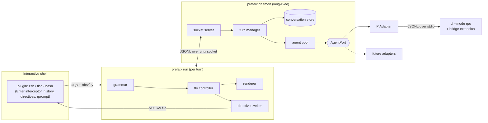
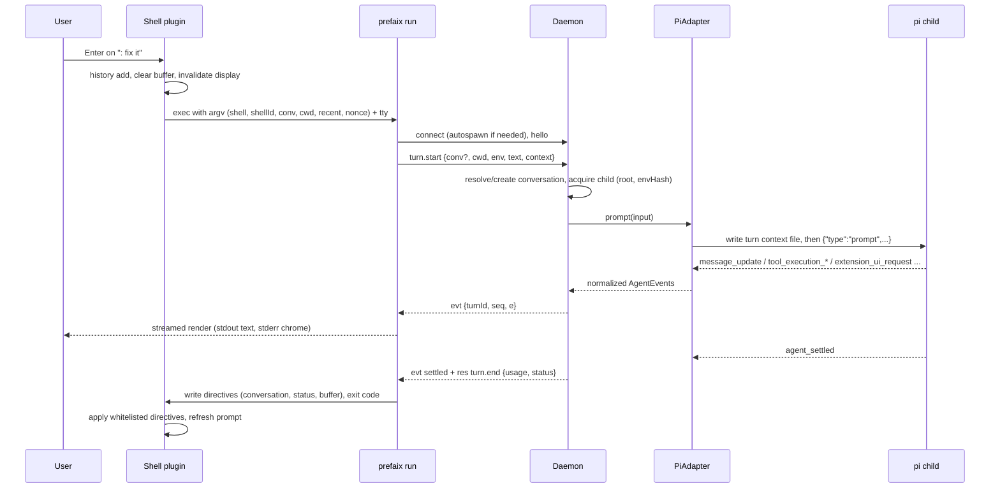

# prefaix — Technical Design

Status: **draft v0.1** (pre-implementation). Items marked **[spike Sn]** depend on a spike in [ROADMAP.md](ROADMAP.md) and may change.

prefaix is a shell integration layer: type `: fix the failing test` at your normal prompt and an AI coding agent streams its work inline, keeps a sticky conversation per shell, and hands control back to the same prompt. It is modeled on Forge's shell plugin UX, but the agent is swappable. [pi](https://pi.dev) is the first backend.

---

## 1. Goals, non-goals, constraints

### Goals

1. **Stay in the shell.** Prompts, answers, tool activity and follow-ups happen at the shell prompt, with no full-screen app.
2. **zsh, fish, and bash on day one**, with one behavior spec and one shared test suite.
3. **Swappable agent.** Shell plugins and the renderer never see pi-specific data. pi is an adapter behind `AgentPort`.
4. **Fast.** A warm conversation reaches first token with less than 100 ms of prefaix overhead. Normal (non-`:`) commands pay 0 ms.
5. **Your agent, not ours.** prefaix runs your installed pi with your extensions, skills, models, and credentials. It does not duplicate model config, MCP, or tools.
6. **Forge muscle memory.** Command names and aliases match Forge's wherever the semantics match.

### Non-goals (v1)

- Replacing pi's TUI. `:tui` hands off to it instead.
- Sandboxing or permission systems beyond what the agent provides.
- Telemetry. There is none, by design.
- Windows (native). WSL is expected to work but is untested at launch.
- ble.sh, xonsh, nushell, PowerShell.

### Constraints

- Node **≥ 22.19** (pi's own floor). The package is `@miraiforge/prefaix`, the bin is `prefaix`, and the license is Apache-2.0.
- bash **≥ 4.4** for `:` interception. macOS ships 3.2, which gets a degraded mode (§4.1.4).
- The dev/test harness must never bill Anthropic or OpenAI models (Allan's cost rule). Live tests refuse to run unless an allowed provider/model is pinned explicitly (§12.4). Allan's pi default is `openai-codex/gpt-6-sol`, so the harness can't rely on the default.

---

## 2. Decisions at a glance

| # | Decision | Why | Rejected alternatives |
|---|---|---|---|
| D1 | **Daemon holds warm agent processes.** A short-lived client renders each turn. | Measured pi RPC cold start on Allan's machine: **~740–860 ms** with 5 extensions (~215 ms with `--no-extensions`), plus up to ~500 ms shutdown. Spawning per prompt is too slow. | Spawn `pi -p` per prompt (the Forge/pi-zsh-plugin model); a persistent PTY wrapper (pish). |
| D2 | **Agent runs as a child process over RPC** (`pi --mode rpc`), not the in-process SDK. | Crash isolation. It uses *your* installed pi version and extensions, and each child gets its own env and cwd. | pi SDK inside the daemon; pi's `RpcClient` at runtime (pulls in a second full pi install and invites version skew). |
| D3 | **Inline execution from an Enter interceptor**: zsh ZLE widget, fish `bind \r`, bash macro + `bind -x`. | This is the only way to see the raw line before the shell parses it, so apostrophes, `$()`, globs, and `!` all work unquoted. | Defining a `:` function or using preexec/`command_not_found`, which break on quotes and globs. |
| D4 | **Renderer lives in the foreground client.** The daemon only relays normalized events. | The client owns the tty (size, raw keys, colors). The daemon stays headless, which enables detach/attach later. | Daemon writes to the tty directly. |
| D5 | **Client puts the tty in raw mode during a turn.** | Esc and Ctrl+C arrive as bytes (abort without signals hitting the shell). Typed-ahead text is captured and restored into the prompt instead of garbling output. | Cooked mode with SIGINT only (no Esc; typing corrupts the stream). |
| D6 | **The shell owns "which conversation"; the daemon owns conversation data.** `PREFAIX_CONVERSATION_ID` is a non-exported shell variable. | Survives daemon restarts. Each terminal/pane gets its own conversation (Forge parity). Subshells don't inherit it by accident. | Daemon-side shell registry as the source of truth. |
| D7 | **Directives are data, not code.** The client returns state changes as a NUL-delimited key/value file the plugin applies through a whitelist. | No `eval` or `source` of generated text, so model output can never be executed by the shell. | Sourcing generated shell code; fd-3 capture through command substitution. |
| D8 | **The agent inherits the invoking shell's environment.** Env changes trigger a child respawn. | `nvm use`, venvs, and exported API keys must affect the agent's `bash` tool, exactly as if you'd run `pi` in that shell. | The daemon's frozen spawn-time env. |
| D9 | **A bundled pi bridge extension** (`-e`) injects per-turn shell context as a *system prompt section* and switches tools for personas. | Keeps your visible prompt clean in pi's transcript/TUI. Personas need no respawn. | Prepending a context blob to every user message (kept only as a fallback). |
| D10 | **Single npm package, layered folders, one bundled file**, with lazy imports on the hot path. | One install, one version, and a fast `prefaix run` cold start. | A monorepo of 4–5 packages (premature). |
| D11 | **TOML config** at `~/.config/prefaix/config.toml`, plus `PREFAIX_*` env overrides. | Human-edited and commentable. The dependency is a ~5 KB parser. | YAML (large dependency, whitespace footguns) or JSON (no comments). |
| D12 | **Test through a real pty and terminal emulator** (node-pty + `@xterm/headless`) against a **FakeAgent**, on all three shells, on Linux and macOS in CI. | Most bugs live in the shell and terminal layer, and this checks the actual screen output. | Mocked readline tests; expect scripts only. |

---

## 3. User experience spec

### 3.1 Line grammar

The plugin inspects only the **first line** of the buffer, and only on Enter:

| Buffer | Result |
|---|---|
| `: <text>` | Prompt the active conversation (creating one if needed). |
| `:<name>` or `:<name> <args>` where name matches `[A-Za-z][A-Za-z0-9_-]*` | prefaix command (§3.2), persona (`:ask …`), or agent command (skill/template). Unknown names produce an error listing the closest matches. |
| `:/<cmd> [args]` | Pass-through to the agent's slash command (pi: prompt templates, extension commands, `skill:*`). |
| `:` alone; `: >file`; `: ${X:=1}`; `:;` | **Pass through** to the shell. The builtin idioms still work. The default passthrough regex is `^:\s*($|[>|<&;$({\[])`, and it is configurable. |
| ` : …` (leading space) or `\: …` | Pass through. This is the explicit escape hatch. |
| anything else | Normal shell execution. prefaix is not involved. |

The shell side only needs a cheap prefix test. **The authoritative parse happens in TypeScript** (`src/shells/grammar.ts`), so the three shells cannot drift: the plugin hands the raw buffer to `prefaix run`, and the client decides what it means.

History: the original line is added to shell history exactly as typed (zsh `print -s`, bash `history -s`, fish `history append`), so ↑ recalls `: fix the test`.

### 3.2 Commands

"Class" is **run**, which prints output and then shows a fresh prompt, or **edit**, which puts text into the command line for review without running it.

| Command | Alias | Class | Milestone | Notes |
|---|---|---|---|---|
| `: <text>` | | run | MVP | Prompt the active conversation. |
| `:new [text]` | `:n` | run | MVP | New conversation, optionally prompting immediately. |
| `:conversation [query]` | `:c` | run | MVP | Picker (fzf if installed, built-in list otherwise). Switches the shell's conversation. `:c -` toggles to the previous one. |
| `:model [query]` | `:m` | run | MVP | Pick or set the model for this conversation. |
| `:think [level]` | | run | MVP | `off…max`. Levels come from the backend. |
| `:info` | `:i` | run | MVP | Conversation, model, thinking level, root, tokens/cost, context %, backend, daemon pid. |
| `:copy` | | run | MVP | Last assistant text to the clipboard (pbcopy / wl-copy / xclip / OSC 52). |
| `:help` | `:?` | run | MVP | Grammar plus commands, including agent commands. |
| `:doctor` | | run | MVP | Same as `prefaix doctor`. |
| `:suggest <want>` | `:s` | **edit** | M4 | Generates one shell command into the buffer. |
| `:commit [hint]` | | **edit** | M4 | Puts `git commit -m '…'` from the staged diff into the buffer. |
| `:retry` | `:r` | run | M4 | Re-run the last prompt. |
| `:compact [focus]` | | run | M4 | Backend compaction. |
| `:rename <title>` | `:rn` | run | M4 | |
| `:skill [name] [args]` | | run | M4 | Picker over agent skills. pi maps this to `/skill:<name>`. |
| `:ask <q>` / `:plan <task>` | | run | M4 | Built-in personas (read-only tools plus a persona prompt). User-defined personas come from config. |
| `:attach` | | run | M4 | Re-attach to a detached or still-running turn and replay its output. |
| `:abort` | | run | M4 | Abort a detached turn. |
| `:tui` | | run | M4 | Opens this conversation in pi's full TUI. Afterwards the conversation continues in prefaix. |
| `:backend [id]` | | run | M5 | Only shows the current backend until a second adapter exists. |

### 3.3 Keys during a turn

| Key | Action |
|---|---|
| Esc / Ctrl+C | Abort the turn (clear the queue, then abort). A second Ctrl+C within 1 s force-detaches the client. |
| Ctrl+Z | **Detach** (M4). The turn continues in the daemon, the prompt returns, the right prompt shows `⟳`, and `:attach` replays. |
| Other typing | Captured, never echoed into the stream, and **restored into your next prompt buffer**, so typeahead works like normal shell typeahead. In M4, Enter sends the captured line as a **steer** message instead. |

### 3.4 What a turn looks like

```text
~/proj main ❯ : why does the auth test fail?
  ⏺ bash  $ bun test auth                          ✓ 1.2s
  ⏺ read  src/auth/session.ts                      ✓
The test expects `expiresAt` in seconds, but `createSession()` returns ms…
  ⏺ edit  src/auth/session.ts (+3 −1)              ✓
Fixed. Re-run `bun test auth` to confirm.
── 14.2s · 3 tools · $0.018 · ctx 22% · gemini-3.8-flash
~/proj main* ❯ █                                         pfx·auth-test·22%
```

The assistant's text goes to **stdout**; tool lines, spinners, and the footer go to **stderr**. The prompt is fully refreshed after the turn (precmd/PROMPT_COMMAND/fish_prompt re-run), so git status in the prompt reflects the agent's edits.

---

## 4. Architecture



### 4.0 Turn sequence



---

### 4.1 Shell plugins

Setup is one line in each rc file:

```sh
eval "$(prefaix init zsh)"      # ~/.zshrc
eval "$(prefaix init bash)"     # ~/.bashrc
prefaix init fish | source      # ~/.config/fish/config.fish
```

`prefaix init <shell>` prints the plugin script embedded in the package. Plugins are intentionally thin (target: under 250 lines each). They never parse commands, render, or talk to the daemon.

#### 4.1.0 Common plugin contract

Every plugin implements the same six responsibilities, verified by the shared e2e suite (§12.3):

1. **Identity.** At load it sets non-exported `PREFAIX_SHELL_ID` (pid plus start time plus random) unless one is already set, which survives re-sourcing the rc. It also initializes `PREFAIX_CONVERSATION_ID` and `PREFAIX_STATUS` to empty.
2. **Intercept.** On Enter it runs the cheap prefix test (§3.1). On a miss it delegates to the shell's normal accept action, calling the *possibly wrapped* widget so zsh-autosuggestions and syntax-highlighting keep working.
3. **Invoke.** On a hit it adds the line to history, clears the buffer, moves below the prompt line, and runs:
   ```text
   command prefaix run --shell <kind> --shell-id <id> --conversation <id|""> \
     --nonce <n> --directives <path> --cwd "$PWD" \
     --recent <exit>:<cmd> … -- "<raw buffer>"   </dev/tty >/dev/tty 2>/dev/tty
   ```
   The raw buffer is passed as a **single argv element**, so no quoting layer can mangle it.
4. **Apply directives.** It reads `$RUNTIME/shells/<shellId>/directives`, a sequence of `key\0value\0` pairs, and ignores the file unless its `nonce` matches the one it passed. Only these keys are applied: `conversation`, `status`, `buffer`, `cursor`. Unknown keys are ignored.
5. **Refresh.** For *run* class, with `buffer` empty, it accepts an **empty line**, so the shell draws a new prompt and re-runs precmd/PROMPT_COMMAND/fish_prompt. For *edit* class, or when typeahead was captured, it sets the buffer and cursor and redraws the prompt without executing.
6. **Status and right prompt.** It exposes `prefaix_prompt_info` (and the equivalent for fish/bash), which returns `PREFAIX_STATUS`. For detached turns it also reads `$RUNTIME/shells/<shellId>/status` with shell builtins only, so a prompt costs 0 extra processes.

Why directives are data: the `buffer` value can contain model-generated shell code (from `:suggest`). Assigning it to `BUFFER`, `READLINE_LINE`, or `commandline -r` never evaluates it, and the user still has to press Enter.

Reading the NUL-delimited file uses builtins only:

- zsh: `${(0)"$(<file)"}` splits on NUL.
- bash: `while IFS= read -r -d '' k && IFS= read -r -d '' v`.
- fish: `string split0 < file`.

#### 4.1.1 zsh

- Defines widget `prefaix-accept-line` and binds `^M`/`^J` in the `main`, `emacs`, `viins`, and `vicmd` keymaps. It re-binds after zsh-vi-mode initializes (`zvm_after_init_commands`), the same issue Forge hit.
- Passthrough calls `zle accept-line`, not `.accept-line`, so other plugins' wrappers still run.
- Hit path: `print -s -- $line` → `BUFFER=""` → `zle -I` → run the client → apply directives → either `zle accept-line` on the empty buffer (run class, so precmd re-runs) or set `BUFFER`/`CURSOR` and `zle reset-prompt` (edit class). **[spike S5]** Confirm there is no duplicate blank prompt line and that Forge's `BUFFERLINES` padding trick is unnecessary with an empty accept.
- Emits OSC 133 B/C/D around the turn when the terminal supports it (Ghostty, WezTerm, iTerm2, kitty, VS Code), because widget-dispatched commands bypass the terminal's own preexec markers. This is Forge's lesson about resize and reflow.
- Right prompt: prepends `$(prefaix_prompt_info)` to `RPROMPT` only if the user opts in (`ui.rprompt = "auto"` detects an existing `RPROMPT`, p10k, or starship and then prints integration hints instead).
- Context ring buffer: `preexec` records the command, and a *prepended* `precmd` records `$?` before themes overwrite it. It keeps the last N=10 entries in a zsh array.
- Optional: registers `ZSH_HIGHLIGHT_PATTERNS+=(':*' …)` when zsh-syntax-highlighting's pattern highlighter is active, so `:cmd` isn't painted red.

#### 4.1.2 fish (≥ 3.6; 4.x primary)

- `bind \r` and `bind \n` to `__prefaix_accept_line` in the default and `insert` modes. It follows vi mode via `fish_bind_mode` and uses fish 4 key names where required.
- Buffer: `commandline | string collect` preserves multi-line input.
- History: `builtin history append -- $line`, falling back to `history merge` on older fish, as in Allan's Forge fish plugin. **[spike S6]** Verify recall ordering and dedupe.
- Hit path: `commandline -r ""` → `echo` → client → directives → `commandline -f repaint` (re-runs `fish_prompt`/`fish_right_prompt`) or `commandline -r $buffer`.
- Highlighting: a regex abbreviation for `:[A-Za-z][-A-Za-z0-9_]*` in command position with a no-op expansion function, so `:cmd` gets command color instead of error red. This is the trick from the Forge fish PR.
- Right prompt: wraps an existing `fish_right_prompt` on the first `fish_prompt` event, so starship and tide are wrapped rather than replaced.
- Context: `fish_preexec` and `fish_postexec` events (`$status`).

#### 4.1.3 bash (≥ 4.4)

bash's readline can't run a shell function and then accept the line from a single key, so Enter becomes a two-step **macro** whose second key is **re-bound dynamically**:

```bash
bind -x '"\C-x\C-_1": __prefaix_dispatch'      # step 1: inspect READLINE_LINE
bind    '"\C-x\C-_2": accept-line'             # step 2: default action
bind    '"\C-m": "\C-x\C-_1\C-x\C-_2"'          # Enter = step1 then step2
bind    '"\C-j": "\C-x\C-_1\C-x\C-_2"'
```

- `__prefaix_dispatch`, on a miss, re-binds step 2 to `accept-line`, so the line runs normally.
- On a hit it runs `history -s -- "$line"`, sets `READLINE_LINE=""`, runs the client, and applies directives.
  - **Run class:** step 2 stays `accept-line`. The empty line prints a fresh prompt and PROMPT_COMMAND runs.
  - **Edit class:** it sets `READLINE_LINE`/`READLINE_POINT` and re-binds step 2 to a no-op, so the suggestion waits for the user.
- The bindings are installed in the `emacs`, `vi-insert`, and `vi-command` keymaps.
- **[spike S4]** Verify on bash 4.4, 5.1, and 5.2 (macro plus dynamic re-bind timing, multi-line, `bind -x` tty handoff to a raw-mode child, and interaction with bash-preexec, atuin, and starship).
- Context: a `trap DEBUG` wrapper when bash-preexec is absent; bash-preexec's `preexec_functions` when present.
- Right prompt: none in bash. prefaix offers `__prefaix_ps1` for PS1 and a starship custom-module snippet.

#### 4.1.4 bash 3.2 (macOS `/bin/bash`) degraded mode

`READLINE_LINE` doesn't exist before bash 4, so `prefaix init bash` detects the old version and instead:

- prints a one-time notice with `brew install bash` guidance, and
- defines `pfx`. With arguments it prompts with them (normal shell quoting applies). With no arguments it reads one line via `read -e` (readline, no quoting issues) and prompts with that.

No `:` interception happens on 3.2.

#### 4.1.5 Coexistence

`prefaix doctor` and `prefaix init` warn about conflicts:

| Neighbor | Handling |
|---|---|
| Forge shell plugin (`forge zsh plugin`, `forge.fish`) | Both claim Enter and `:`. Doctor detects it in the rc or bindings and prints a migration note. The command mapping is in the README. |
| zsh-autosuggestions / zsh-syntax-highlighting | Delegate via the wrapped `accept-line`. Load order is documented: prefaix loads before syntax-highlighting. |
| zsh-vi-mode, fish vi mode, bash vi mode | Bind in all relevant keymaps; re-apply after zvm init. |
| atuin, fzf key bindings, mcfly | These bind ↑ and Ctrl+R, not Enter. No conflict, but covered by e2e. |
| starship, p10k, tide | Right-prompt integration hints and no clobbering. |
| ble.sh | Unsupported in v1. Doctor warns. |

---

### 4.2 Client (`prefaix run`)

A short-lived process, one per interception. Its hot path imports only `client/*`, `core/*`, and `shells/grammar.ts`. The daemon, adapters, and config loader are dynamically imported when needed.

**Steps**

1. Parse argv; run the grammar on the raw line. Local-only commands (`:help`, a `:doctor` shortcut) skip the daemon.
2. Connect to the daemon (§4.3.1), autospawning it if needed. Hello and version check.
3. Collect context: cwd, filtered env (§7.2), recent commands, terminal size and color depth, and whether stdout is a TTY.
4. Send the request. For turns, enter **tty mode**:
   - `setRawMode(true)` on `/dev/tty`, restored on every exit path (normal, error, signal, uncaught).
   - **[spike S7]** Confirm libuv restores the *line editor's* termios, not plain cooked mode. If it doesn't, save and restore via `stty -g`.
   - Key handling per §3.3, with an Esc-sequence disambiguation timeout of 25 ms so arrow keys aren't read as Esc.
   - SIGWINCH updates the renderer width.
5. Render events (§4.2.1). Answer UI dialogs (§4.2.2).
6. On `turn.end`, write directives (`conversation`, `status`, `buffer` from typeahead or edit output) and exit.

**Exit codes:** 0 ok · 1 agent error · 2 usage or unknown command · 3 daemon unavailable · 4 agent unavailable (pi missing or broken) · 130 aborted.

#### 4.2.1 Renderer

- **Streaming markdown styler.** It styles text as it streams, holding back at most a few characters when a `*`, `` ` ``, or `_` needs disambiguation.
  - Line-start rules: headings, lists, quotes, and ```` ``` ```` fences. Code blocks are dim or colored, with no inline styling. Tables pass through unchanged.
  - Output is never hard-wrapped, so copy-paste gets the original text. Soft-wrapping is the terminal's job.
  - Syntax highlighting inside fences is out of scope for v1.
- **Tool lines** go to stderr. A single line `⏺ <name>  <summary>` is updated in place (`\r\x1b[2K`) until `tool_end`, then finalized with ✓/✗ and duration. In-place updates are used only while no assistant text is mid-line; otherwise a new line is started.
- **Spinner/footer:** one bottom status line while waiting (`⠋ thinking… 3.2s · esc to abort`). It is erased before any text write and never interleaved.
- **Thinking:** `ui.thinking = "hidden" | "summary" | "stream"` (default `hidden`, shown as a spinner label).
- **Final footer:** duration · tool count · cost · context % · model. The fields are configurable.
- **Degrades:** non-TTY or `NO_COLOR` or `PREFAIX_PLAIN=1` gives plain text, no spinner, and one line per tool event.
- **Notices** (extension `notify`, `extension_error`, retries, compaction) print as one dim line on stderr.

#### 4.2.2 UI dialogs (`ui_request`)

| Kind | Client behavior |
|---|---|
| `select` | Inline arrow-key list (fzf is not used here, to keep the turn's tty ownership simple). |
| `confirm` | `y/n` prompt. |
| `input` | Single-line editor. |
| `editor` | `$VISUAL`/`$EDITOR` on a temp file, with raw mode released while it runs. |
| none attached | If the turn is detached, the daemon answers `cancelled` immediately and emits a notice. The agent's own timeout also applies. |

Fire-and-forget requests map as follows:

| Request | Behavior |
|---|---|
| `notify` | Notice line. |
| `setStatus` | Status map shown in `:info` and (optionally) in the footer. |
| `setWidget` | Ignored by default. pi-lens and others push widgets at startup, as observed in the S2 measurement. Shown in `:info` when `ui.widgets = "info"`. |
| `setTitle` | OSC 0 title if `ui.set_title = true`. |
| `set_editor_text` | Becomes the `buffer` directive. An agent or extension can hand you a command to review. |

---

### 4.3 Daemon (`prefaix daemon`)

One daemon per user, auto-spawned, headless, with an idle exit.

#### 4.3.1 Lifecycle and socket

- **Socket:** `$RUNTIME/daemon.sock`, mode 0600 in a 0700 dir.
  - `$RUNTIME` is `$XDG_RUNTIME_DIR/prefaix`, else `~/.local/state/prefaix/run`.
  - If the socket path exceeds the `sun_path` limit (104 bytes on macOS, 108 on Linux), fall back to `/tmp/prefaix-$UID/`.
- **Autospawn:**
  1. The client gets ENOENT or ECONNREFUSED.
  2. It takes `daemon.lock` (O_EXCL, containing the pid; a stale lock whose pid is dead is removed).
  3. It spawns `process.execPath <bundle> daemon`, detached with its own session, stdio to the log, `unref()`.
  4. It polls connect for up to 3 s with backoff.
- **Handshake:** `hello {v, version}`.
  - Protocol `v` mismatch is fatal, with a hint.
  - A package version mismatch (after `npm i -g` upgrades) means: if the old daemon is idle, the client asks it to `daemon.stop` and spawns a fresh one. If it's busy, the client uses it for this turn and prints `restart pending`, and the daemon exits after its turns settle.
- **Idle exit:** 30 min with no clients and no running turns. Children are closed gracefully (stdin EOF, then SIGTERM after 3 s, then SIGKILL after 5 s).
- **Logs:** `~/.local/state/prefaix/logs/daemon.log`, size-rotated. Each child's stderr is captured with a prefix, and never parsed as protocol.

#### 4.3.2 Wire protocol (client ↔ daemon)

Newline-delimited JSON over the unix socket. Framing splits on `\n` only (not `readline`), so U+2028/2029 inside strings are safe. The same rule applies to pi's stdio.

```jsonc
// client → daemon
{"t":"hello","v":1,"version":"0.1.0","pid":4242}
{"t":"req","id":"r1","op":"turn.start","params":{ /* TurnStartParams */ }}
{"t":"req","id":"r2","op":"turn.abort","params":{"turnId":"t_01J…"}}
{"t":"req","id":"r3","op":"ui.respond","params":{"turnId":"t_01J…","requestId":"u1","response":{"value":"Allow"}}}

// daemon → client
{"t":"hello","v":1,"version":"0.1.0","pid":777}
{"t":"res","id":"r1","ok":true,"data":{"turnId":"t_01J…","conversationId":"c_01J…"}}
{"t":"evt","turnId":"t_01J…","seq":17,"e":{"type":"text_delta","block":0,"text":"Fixed."}}
{"t":"res","id":"r9","ok":false,"error":{"code":"AGENT_UNAVAILABLE","message":"pi not found on PATH","hint":"prefaix doctor"}}
```

**Operations**

| Area | Ops |
|---|---|
| Turns | `turn.start`, `turn.abort`, `turn.steer` (M4), `turn.attach {turnId?, fromSeq}` (M4), `ui.respond` |
| Conversations | `conv.new`, `conv.list`, `conv.get`, `conv.rename`, `conv.lastText`, `conv.compact` |
| Model and commands | `model.list`, `model.set`, `thinking.set`, `commands.list` |
| Status and daemon | `status.get`, `daemon.ping`, `daemon.stop` |

```ts
interface TurnStartParams {
  conversationId?: string;          // absent → create
  newConversation?: boolean;        // :new <text>
  shell: { kind: "zsh" | "fish" | "bash"; version: string; shellId: string; pid: number };
  cwd: string;
  env: Record<string, string>;      // filtered (§7.2)
  text: string;
  persona?: string;                 // "ask" | "plan" | user-defined
  context: {
    recent: { cmd: string; exit: number | null; at?: number }[];
    os: string;
    term: { cols: number; rows: number; colors: 0 | 16 | 256 | 16777216; program?: string };
  };
  onDisconnect?: "abort" | "continue";   // default "abort"; Ctrl+Z sends turn.detach first
}
```

`seq` is per turn and monotonic. The daemon keeps a bounded event ring (default 4 MB) for the active turn and the last finished turn of each conversation, which is what makes `:attach` replay possible.

#### 4.3.3 Turn manager

- **One running turn per conversation.** A `turn.start` for a busy conversation (for example, another shell picked it via `:c`) returns `CONVERSATION_BUSY` with a `:attach` hint. In M4 it queues as a follow-up instead, if the backend supports it.
- **Abort:** `clear_queue` then `abort` on the adapter. It always resolves to a `settled {stopReason:"aborted"}`.
- **Disconnect:**
  - If the client socket closes without a detach, apply `onDisconnect` (default **abort**, the least surprise, matching closing a pi TUI).
  - Detach (M4) marks the turn as unowned, keeps it running, and writes the shell's status file (`⟳ running` / `✓ done` / `✗ error`).

#### 4.3.4 Agent pool

| Rule | Detail |
|---|---|
| Binding | One child per active conversation, bound to its **root** and **env fingerprint**. |
| Env change | If the next turn's env fingerprint differs (a new `PATH`, `VIRTUAL_ENV`, exported keys…), respawn the child on the same session (`--session <file>`). This costs about 0.8 s, and only when the env actually changed. |
| Capacity | `pool.max_children` (default 6). The least-recently-used idle child is closed when capacity is reached. The session lives on disk, so reopening only costs a respawn. |
| Idle | A child idle for 15 min is closed. |
| Spare | After each turn, keep **one spare** child pre-warmed for the most recent (root, envHash), so the next `:new` or first prompt in a new shell avoids cold start. A spare is adopted by reading `sessionFile`/`sessionId` via `get_state`. **[spike S2]** Measure RSS per child to set defaults. |
| Crash | A child exiting mid-turn produces `settled {stopReason:"error"}` plus a notice. The next turn respawns with `--session <file>`. Three crashes within 60 s mark the conversation `degraded` and surface `prefaix doctor`. |

#### 4.3.5 Conversation store

prefaix persists **its own index**. Each adapter keeps its native transcript (pi session JSONL). Files live under `~/.local/state/prefaix/conversations/<id>.json` and are written atomically (temp file, fsync, rename).

```ts
interface ConversationRecord {
  id: string;                  // "c_" + ULID
  backend: "pi";
  native: { sessionFile?: string; sessionId?: string };   // adapter-owned, opaque to core
  title: string;               // first prompt, truncated to 60 chars; :rename overrides
  root: string;                // workspace root at creation (git toplevel or cwd)
  createdAt: string; updatedAt: string;
  model?: { provider: string; id: string }; thinking?: string;
  persona?: string;
  stats: { turns: number; costUsd?: number; lastContextPct?: number };
  createdBy: { shell: "zsh" | "fish" | "bash"; host: string };
}
```

Per-shell hints (the previous conversation for `:c -`, the last conversation per root) live in `shells/<shellId>.json`, which is garbage-collected when the shell pid is dead.

#### 4.3.6 Working directory policy

A conversation is anchored to a **root**: the git toplevel of `cwd` at creation, else `cwd`. The pi child runs with `cwd = root`. Every turn tells the model the exact shell `cwd` (§7.1). Moving within the root costs nothing.

When a turn's `cwd` is **outside** the root, `workspace.cwd_policy` decides:

| Policy | Behavior |
|---|---|
| `follow` | Respawn the child in the new root on the same session. **[spike S3]** Check which cwd pi's tools use after `--session <file>` from another directory, and whether the `cwd` prompt section updates. This becomes the default if S3 passes. |
| `split` | Start (or resume) a separate conversation for the new root, with a notice: `↪ new conversation for ~/other (:c to switch back)`. `cd` back resumes the previous one. This is the default if S3 fails. |
| `stay` | Keep the old root and just report the new cwd to the model. |

---

### 4.4 AgentPort (the swap boundary)

Everything above this line is backend-agnostic. `src/core/agent-port.ts`:

```ts
export interface AgentBackend {
  readonly id: string;                         // "pi", "fake", …
  readonly capabilities: Capabilities;
  probe(): Promise<ProbeResult>;               // for doctor: installed? version? usable?
  open(opts: OpenOptions): Promise<AgentSession>;
}

export interface Capabilities {
  steer: boolean; followUp: boolean; abort: true;
  models: boolean; thinkingLevels: boolean; compact: boolean;
  slashCommands: boolean; skills: boolean; uiDialogs: boolean;
  contextSections: boolean;                    // can take per-turn context out-of-band
  personasWithoutRespawn: boolean;
  handoffTui: boolean;
}

export interface OpenOptions {
  root: string; env: Record<string, string>;
  resume?: NativeRef;                          // from ConversationRecord.native
  title?: string; model?: ModelRef; thinking?: string; persona?: PersonaSpec;
}

export interface AgentSession {
  readonly native: NativeRef;
  prompt(input: PromptInput, signal: AbortSignal): AsyncIterable<AgentEvent>;
  steer?(text: string): Promise<void>;
  abort(): Promise<void>;
  respondUi(requestId: string, response: UiResponse): void;
  state(): Promise<AgentState>;                // model, thinking, busy, usage, contextPct, name
  listModels(): Promise<ModelInfo[]>;
  setModel(ref: ModelRef): Promise<void>;
  setThinking?(level: string): Promise<void>;
  listCommands?(): Promise<AgentCommand[]>;    // skills, templates, extension commands
  compact?(focus?: string): Promise<CompactResult>;
  lastAssistantText(): Promise<string | null>;
  setPersona?(p: PersonaSpec): Promise<void>;
  rename?(title: string): Promise<void>;
  tuiCommand?(): { argv: string[]; cwd: string };   // for :tui handoff
  close(): Promise<void>;
}

export interface PromptInput {
  text: string;
  context: ShellContext;                       // cwd, shell, recent commands, os, term
  persona?: PersonaSpec;
}

export type AgentEvent =
  | { type: "turn_start" }
  | { type: "text_delta"; block: number; text: string }
  | { type: "text_end"; block: number }
  | { type: "thinking_delta"; text: string }
  | { type: "tool_start"; id: string; name: string; summary: string }
  | { type: "tool_update"; id: string; preview?: string }
  | { type: "tool_end"; id: string; ok: boolean; summary?: string; ms?: number }
  | { type: "ui_request"; id: string; kind: "select" | "confirm" | "input" | "editor";
      title: string; message?: string; options?: string[]; prefill?: string; timeoutMs?: number }
  | { type: "set_buffer"; text: string }
  | { type: "notice"; level: "info" | "warn" | "error"; text: string; source?: string }
  | { type: "status"; key: string; text?: string }
  | { type: "retry"; attempt: number; max: number; delayMs: number; reason: string }
  | { type: "compaction"; phase: "start" | "end"; reason: string; ok?: boolean }
  | { type: "usage"; input: number; output: number; costUsd?: number; contextPct?: number | null }
  | { type: "settled"; stopReason: "stop" | "aborted" | "error" | "length"; error?: string };
```

Rules:

- `src/client/**` and `src/shells/**` must not import `src/agents/**`. This is enforced with ESLint `no-restricted-imports`.
- Only `src/agents/registry.ts` knows the concrete adapters.
- Tool `summary` strings are produced **by the adapter**, so the renderer never learns tool schemas.
- Missing capabilities degrade to a clear message (`:think isn't supported by <backend>`), never a crash.

---

### 4.5 PiAdapter

#### 4.5.1 Process

```text
pi --mode rpc
   --session-id <native-id> | --session <file>      # create vs resume (see below)
   --name "<title>"                                  # visible in pi's own session picker
   -e <bundle>/pi-bridge.js                          # prefaix bridge extension
   [--model <p/id>] [--thinking <lvl>] [--offline?]  # only if configured; else pi's defaults
cwd = root, env = shell env (filtered), stdio = pipes
```

- **Create:** `--session-id pfx-<ULID>` gives a deterministic native id, and pi creates the session if it's missing. `sessionFile` is recorded after the first `get_state`.
- **Resume:** `--session <sessionFile>`, which is robust across roots **[spike S3]**.
- **Session storage** stays in pi's default `~/.pi/agent/sessions/` by default, so `pi --resume` and `:tui` see prefaix conversations. `agent.pi.session_dir` can isolate them.
- **Readiness** means the first successful `get_state` response. `extension_ui_request` records can arrive **before** it (observed: `setWidget`/`setStatus` from pi-lens), and are buffered and applied.
- **Shutdown:** close stdin, wait for exit, then escalate (§4.3.1).

#### 4.5.2 RPC transport

About 300 lines, in-house:

- `StringDecoder` plus LF-only splitting, with a trailing `\r` stripped.
- Request correlation by `id`, with per-command timeouts (default 10 s; `prompt` resolves on *accept*, and completion is `agent_settled`).
- stderr is captured to the log.
- Unexpected exit rejects every pending request and produces `settled(error)` for the running turn.

Type definitions are imported **type-only** from a pinned dev dependency on `@earendil-works/pi-coding-agent`, if its `rpc-types` are exported; otherwise a minimal typed subset is vendored. Either way there is no runtime dependency on pi's npm package.

#### 4.5.3 Event mapping

| pi RPC | AgentEvent |
|---|---|
| `agent_start` | `turn_start` (first only) |
| `message_update` → `text_delta` / `text_end` | `text_delta` / `text_end` (by `contentIndex`) |
| `message_update` → `thinking_*` | `thinking_delta` |
| `message_update` → `toolcall_start` | Buffered. The tool line starts at `tool_execution_start`, when args are complete. |
| `tool_execution_start` | `tool_start` with an adapter-built `summary`: `bash` → `$ <first line>`, `read` → path, `edit`/`write` → path, `grep`/`find` → pattern, unknown → the name plus the first string arg |
| `tool_execution_update` | `tool_update` (last line of `partialResult`, throttled to 10 Hz) |
| `tool_execution_end` | `tool_end {ok: !isError}` (+ `+x −y` for edits when derivable from `details`) |
| `message_update.usage`, `message_end` | `usage` (cumulative), with `get_session_stats` on settle for cost and context % |
| `auto_retry_start` / `_end` | `retry` / notice on final failure |
| `compaction_start` / `_end` | `compaction` |
| `extension_ui_request` (dialog) | `ui_request`; the reply goes back as `extension_ui_response` |
| `extension_ui_request` (`notify` / `setStatus` / `setWidget` / `setTitle` / `set_editor_text`) | `notice` / `status` / (ignored or info) / (title) / `set_buffer` |
| `extension_error` | `notice {level:"warn"}` |
| `agent_end {willRetry}` | Nothing, because more work may follow. |
| **`agent_settled`** | `settled`, with `stopReason` from the last assistant `message_end` |

#### 4.5.4 Bridge extension (`pi-bridge.js`, shipped inside the package)

A tiny pi extension, loaded with `-e`, that makes pi prefaix-aware without touching the user's pi config:

- **Per-turn context as a prompt section.**
  1. Before each `prompt`, the adapter writes `$RUNTIME/turns/<childPid>.json` (shell, cwd, recent commands, persona).
  2. On `before_agent_start` the extension reads the file and sets a `prefaix` system-prompt section (§7.1). pi records it as a section delta, so your **visible user message stays exactly what you typed**.
  3. Writes are sequential per child, so there is no race.
- **Personas without respawn.** On a persona change it calls `pi.setActiveTools([...])` and patches a `persona` section. `:ask` means `read, grep, find, ls` plus the "answer, don't modify" guideline.
- **`propose_command` tool (M4).** It is active only for `:suggest` and `:commit`. The model returns `{command, explanation}`. The tool result sets `terminate: true`, and the adapter turns the args into `set_buffer`. This produces structured output instead of scraping model prose.
- **Fallback.** If the extension fails to load (the capability probe at spawn fails), context is prepended to the prompt text as a compact `<shell-context>` block and personas respawn with `--tools`.

#### 4.5.5 Commands to pi RPC

| prefaix | pi |
|---|---|
| prompt | `prompt {message}` |
| steer (M4) | `steer` / `prompt {streamingBehavior:"steer"}` |
| abort | `clear_queue` → `abort` (queued text is restored into the buffer directive) |
| `:model` | `get_available_models`, `set_model` |
| `:think` | `get_available_thinking_levels`, `set_thinking_level` |
| `:info` | `get_state`, `get_session_stats` |
| `:copy` | `get_last_assistant_text` |
| `:compact` | `compact {customInstructions}` |
| `:rename` | `set_session_name` |
| `:skill`, `:/cmd`, help | `get_commands`; invoke via `prompt "/name args"` |
| `:retry` (M4) | `get_fork_messages` → `fork` last user entry → prompt its text. **[spike]** Alternatively resend as a new prompt. |
| `:tui` (M4) | Close the pooled child → client runs `pi --session <file>` in `root` with the shell env, stdio inherited → the next turn respawns. |

---

## 5. State, paths, identifiers

| What | Where |
|---|---|
| Config | `$XDG_CONFIG_HOME/prefaix/config.toml` (`~/.config/prefaix/config.toml`) |
| Conversations, shell hints | `$XDG_STATE_HOME/prefaix/` (`~/.local/state/prefaix/`) |
| Logs | `~/.local/state/prefaix/logs/` |
| Runtime (socket, lock, directives, status, turn ctx) | `$XDG_RUNTIME_DIR/prefaix/` or `~/.local/state/prefaix/run/` (0700) |
| Cache (model list for completions) | `~/.cache/prefaix/` |
| pi sessions | pi's default dir (or `agent.pi.session_dir`) |

IDs:

- conversation `c_<ULID>`, turn `t_<ULID>`, request `r<n>`, shell `<pid>-<epoch>-<rand>`
- pi native session id `pfx-<ULID>`, which fits pi's `[A-Za-z0-9._-]` rule and must start and end alphanumeric.

---

## 6. Configuration

```toml
# ~/.config/prefaix/config.toml — every key optional

[agent]
backend = "pi"

[agent.pi]
bin = "pi"                     # or absolute path
# model = "google/gemini-3.8-flash"   # default: pi's own default
# thinking = "medium"
extensions = "user"            # "user" = your pi extensions (parity), "none" = --no-extensions (4x faster start)
# session_dir = "~/.local/state/prefaix/pi-sessions"
extra_args = []

[pool]
max_children = 6
idle_minutes = 15
spare = true

[workspace]
cwd_policy = "follow"          # follow | split | stay   (default set by spike S3)
resume = "none"                # none | last-in-root  — what a brand-new shell's first ":" does

[ui]
thinking = "hidden"            # hidden | summary | stream
footer = ["time", "tools", "cost", "context", "model"]
rprompt = "auto"               # auto | on | off
widgets = "ignore"             # ignore | info
set_title = false
osc133 = "auto"
picker = "auto"                # auto (fzf if present) | builtin

[context]
recent_commands = 10
include_exit_codes = true
redact = true
# extra_redact_patterns = ['(?i)internal-token-[a-z0-9]+']

[env]
passthrough = "all"            # all | allowlist
# allowlist = ["PATH", "HOME", "VIRTUAL_ENV", "NODE_OPTIONS"]
deny = ["PREFAIX_*", "PWD", "OLDPWD", "SHLVL", "_"]

[grammar]
passthrough = '^:\s*($|[>|<&;$({\[])'

[personas.ask]
tools = ["read", "grep", "find", "ls"]
guideline = "Answer the question. Do not modify files."

[personas.plan]
tools = ["read", "grep", "find", "ls"]
guideline = "Produce a numbered plan. Do not modify files."

[commands.suggest]
# model = "google/gemini-3.8-flash"   # fast/cheap model for :suggest
[commands.commit]
max_diff_bytes = 100000
```

Environment overrides use the key path, for example `PREFAIX_AGENT_PI_BIN`, `PREFAIX_UI_THINKING`, and `PREFAIX_PLAIN=1`. `prefaix config check` validates the file with precise errors.

---

## 7. Context, environment, privacy

### 7.1 What the model is told each turn

This is the bridge extension's `prefaix` prompt section (~150 tokens typical):

```text
You are being used from the user's interactive shell via prefaix.
Shell: zsh 5.9 on macOS 27.0 · cwd: /Users/allan/proj/packages/api (workspace root: /Users/allan/proj)
Recent commands (newest last; exit code):
  [0] git pull
  [1] bun test auth
Output is rendered as streaming markdown in a terminal (100 cols). Keep answers concise;
prefer showing commands over long prose.
```

Command **output** is not sent by default. Opt-in terminal scrollback capture (tmux, kitty, WezTerm, as in Forge's context.zsh) is an M5 item behind `context.capture_output = true`.

### 7.2 Environment

- `env.passthrough = "all"` minus `env.deny`. The fingerprint is a hash of the passed env minus volatile keys (`COLUMNS`, `LINES`, `TERM_SESSION_ID`, …).
- Secrets in env never appear in the prompt. They exist only in the child's process env, exactly as if you'd run `pi` yourself.

### 7.3 Redaction

Applied to the recent-commands list before it leaves the client:

- Known token shapes: `sk-…`, `ghp_…`, `gho_…`, `xox[abpr]-…`, `AKIA…`, JWTs, `-----BEGIN … KEY-----`.
- `NAME=value` where NAME matches `(?i)(key|token|secret|pass(word)?|auth|cookie)`, which becomes `NAME=‹redacted›`.
- `--password …` / `-p…` flags on known tools (mysql, psql URLs with credentials).
- User patterns from config.

Unit-tested with a corpus of real-world shapes and false-positive checks.

---

## 8. Failure modes

| Situation | Behavior |
|---|---|
| pi not installed / wrong version | Exit 4. One line: `pi not found — install: …; then prefaix doctor`. Normal shell use is unaffected. |
| Daemon won't start | Exit 3 with log path. `prefaix daemon --foreground` for debugging. |
| Daemon dies mid-turn | Client prints `daemon connection lost` and restores the tty. The next `:` autospawns. Conversations persist (shell var, index, pi session). |
| pi child crashes | `settled(error)` plus notice, and a transparent respawn next turn (§4.3.4). |
| Provider errors / rate limits | pi's auto-retry surfaces as `retry` lines. The final failure prints pi's error text and exits 1. |
| Busy conversation | `CONVERSATION_BUSY` with a `:attach` hint (M4: queue). |
| Terminal closed mid-turn | `onDisconnect` (default abort). |
| Stale socket or lock | Removed when the pid is dead. |
| Corrupt conversation file | Moved to `conversations/.corrupt/` with a notice. The shell's conversation var is cleared via directive. |
| Directive file missing or nonce mismatch | Ignored. The plugin just refreshes the prompt. |
| Non-UTF-8 tool output | Replaced characters in previews. The model-side result is untouched. |

---

## 9. Performance budgets

The baseline is measured on Allan's M-series Mac, with pi 0.87.1 and Node 26.

| Path | Budget | How |
|---|---|---|
| Normal command (no `:`) | +0 processes, < 1 ms | Prefix test in shell builtins only. |
| Prompt draw | +0 processes | Status from shell vars or a builtin file read. |
| `prefaix run` start → daemon hello | p50 < 60 ms, p95 < 120 ms | Single bundled file, lazy imports, no config parse on the hot path unless needed. **[spike S8]** If missed, compile the client (Node SEA or `bun build --compile`). |
| Enter → first token (warm child) | prefaix overhead < 100 ms | Warm pool plus spare. |
| Enter → first token (cold child) | ≈ pi cold start (~0.8 s with extensions) + provider latency | Spare pre-warm hides this for `:new`. |
| Daemon idle RSS | < 60 MB (excluding children) | |

---

## 10. Security

- **Directives** are data (§4.1.0). Nothing generated is ever evaluated by the shell.
- **Socket and runtime dir** are 0600/0700, with owner uid checked on startup. The daemon refuses to run if the dir is group- or world-writable.
- **Turn context files** are 0600 and deleted after `agent_start`.
- **Env transfer** only goes over the local socket, to a same-uid daemon. It is never logged; logs record keys only in debug mode.
- **Redaction** applies before context leaves the client (§7.3).
- **The agent's power is the agent's.** prefaix adds no tool permissions or sandbox. The docs say this plainly. The `:ask`/`:plan` personas are read-only tool sets, which is a convenience, not a security boundary.
- **Supply chain:** runtime dependencies are kept near zero (`smol-toml`, ULID inline). Releases use npm provenance via GitHub OIDC trusted publishing.

---

## 11. Repository layout

```text
prefaix/
  src/
    cli/              # argv (node:util parseArgs), subcommands: run, init, daemon, doctor, conversations, config, debug
    client/           # daemon connection + autospawn, tty controller, keys, directives writer
      render/         # stream-styler, tool-line, spinner, footer, dialogs, theme, capabilities (color/tty)
    daemon/           # server, router, turns, pool, store, status files, logging, lock
    core/             # agent-port, events, capabilities, errors, ids, paths, config schema+loader
    agents/
      registry.ts     # the only place that imports concrete adapters
      pi/             # rpc transport, adapter, mapping, tool summaries, bridge extension source
      fake/           # scripted FakeAgent for tests and demos
    shells/
      grammar.ts      # authoritative line grammar + passthrough
      directives.ts   # NUL k/v writer (and reader for tests)
      zsh/prefaix.zsh
      fish/prefaix.fish
      bash/prefaix.bash
    context/          # ShellContext builder, redaction
  test/
    unit/             # grammar, directives, styler, redaction, mapping, pool, store
    fixtures/pi/      # recorded pi RPC JSONL sessions (allowed providers only)
    contract/         # AgentPort contract suite run against fake and pi (fixture replay)
    e2e/              # node-pty + @xterm/headless harness, scenarios × {zsh, fish, bash}
  scripts/
    record-pi-fixture.ts   # guarded by live-guard (no anthropic/openai)
    live-guard.ts
    spikes/                # throwaway spike scripts (e.g., rpc-startup.mjs)
  docs/  DESIGN.md  ROADMAP.md  adr/  spikes/
```

**Build.** tsup (esbuild) produces `dist/prefaix.js` (ESM, `#!/usr/bin/env node`) plus `dist/pi-bridge.js`. Shell scripts are embedded as string assets. Source maps are included, with `--enable-source-maps` only under `PREFAIX_DEBUG`.

**Tooling** follows MiraiForge conventions: bun as the package manager and script runner, TypeScript strict, vitest, and ESLint with Prettier. `bun run check` runs lint, typecheck, and unit tests.

---

## 12. Testing strategy

### 12.1 Unit

- Grammar: a table of about 150 cases, including passthrough idioms, unicode, and multi-line input.
- Directives: round-trip of arbitrary bytes. **Property tests** feed random strings through the real zsh, bash, and fish reader snippets.
- Markdown stream styler: golden output, with random chunk boundaries so styling is chunking-invariant.
- Redaction corpus.
- Pool, store, and turn manager against FakeAgent.

### 12.2 Adapter contract

One `AgentPort` contract suite (stream, tools, ui dialog round-trip, abort mid-tool, error, retry, settle ordering, `lastAssistantText`, models) runs against:

- **FakeAgent**, which is scripted and deterministic.
- **PiAdapter with fixture replay**: a fake child that replays `test/fixtures/pi/*.jsonl` and asserts the commands it received.
- **PiAdapter live**, opt-in only (§12.4).

A **no-model live smoke** runs whenever `pi` is on PATH, including in CI if installed: spawn, `get_state`, `get_commands`, `get_available_models`, `new_session`, abort-while-idle, and shutdown. It spends zero tokens and catches RPC drift on pi upgrades.

### 12.3 Shell end-to-end

The harness is `node-pty` running the real shell (`zsh -f` / `fish --no-config` / `bash --norc`, then the plugin) inside an `@xterm/headless` terminal at 100×30. It sends keys, waits for screen conditions, and asserts on the **rendered screen** plus side effects (history, variables, directives, prompt refresh). The backend is `PREFAIX_BACKEND=fake` with a named scenario.

The same scenario list runs for every shell. This is the release gate:

1. `ls` and multi-line normal commands are unaffected, with no added latency.
2. `: hello` streams, the prompt returns, and ↑ recalls `: hello`.
3. A second `: …` continues the same conversation, and `:info` shows 2 turns.
4. `:new` isolates. `:c` switches back.
5. Esc and Ctrl+C abort a long turn. The tty is sane afterwards (`stty -a` unchanged).
6. Typeahead during a turn lands in the next prompt buffer.
7. Apostrophes, `$()`, globs, `!`, and `|` in prompts arrive byte-exact.
8. Passthrough idioms (`: > f`, `: ${X:=1}`, ` : x`) behave as the builtin.
9. The prompt refreshes (a precmd counter increments) after a turn.
10. Edit class (M4 `:suggest`): the buffer is set and **not executed**.
11. vi-mode variants of 2 and 5.
12. The daemon is killed mid-turn: the client exits cleanly and the next `:` works.

### 12.4 Live model guard

`scripts/live-guard.ts` runs before any live test or fixture recording.

- It **requires** `PREFAIX_LIVE_PROVIDER` and `PREFAIX_LIVE_MODEL`.
- It refuses `anthropic*`, `openai*`, `openai-codex*`, and any OpenRouter `anthropic/*` or `openai/*` slug.
- It passes `--provider/--model` explicitly, so pi's configured default (currently `openai-codex`) is never used.
- The recorded fixture header stores the provider and model used.

### 12.5 CI

GitHub Actions matrix `{ubuntu-latest, macos-latest} × {node 22, node 24}`:

- lint, typecheck, unit, contract (fake plus fixture), e2e on all three shells. zsh, fish, and bash 5 are installed via apt or brew, and macOS additionally runs bash 3.2 degraded-mode tests.
- The no-model pi smoke runs as an optional job that installs pi.
- Release is a tag-triggered workflow with npm provenance (M3).

---

## 13. Distribution

- `npm i -g @miraiforge/prefaix`, then `prefaix init <shell>` in the rc. `prefaix setup` (M3) appends that line interactively, with a backup and an idempotent marker.
- Later: a Homebrew tap (`miraiforge/tap/prefaix`), a fisher-compatible repo layout for fish users, and prefaix.dev (Cloudflare Pages) with docs, install, and a Forge migration table.
- Versioning is semver. The protocol `v` bumps only on breaking wire changes. The first public release is `0.1.0` after the M3 gate. **Nothing is published before then** (`"private": true` stays until then).

---

## 14. Compatibility matrix (launch target)

| | zsh 5.8+ | fish 3.6+ (4.x primary) | bash 4.4 / 5.x | bash 3.2 |
|---|---|---|---|---|
| `:` interception | ✓ | ✓ | ✓ | ✗ (`pfx` fallback) |
| Prompt refresh | ✓ | ✓ | ✓ | n/a |
| Right prompt | ✓ | ✓ | PS1 helper | ✗ |
| Typeahead restore | ✓ | ✓ | ✓ | ✗ |
| vi mode | ✓ | ✓ | ✓ | ✗ |

Terminals tested manually per release: Ghostty, iTerm2, Terminal.app, WezTerm, kitty, VS Code/Cursor integrated terminal, tmux inside each.

---

## 15. Open questions (tracked as spikes)

| # | Question | Blocks |
|---|---|---|
| S1 | Exact event ordering around abort, retry, and compaction; does `abort` always end in `agent_settled`? | Turn manager |
| S2 | Child RSS; does `--offline` speed spawn without side effects; spare adoption via `get_state` | Pool defaults |
| S3 | `--session <file>` from a different cwd: tool cwd and `cwd` section behavior | `cwd_policy` default |
| S4 | bash macro plus dynamic rebind across 4.4/5.1/5.2 and vi mode | bash plugin |
| S5 | zsh empty-accept refresh vs `reset-prompt`; zvm, autosuggest, and syntax-highlighting interplay | zsh plugin |
| S6 | fish history append/merge semantics on 3.6 and 4.x; `repaint` vs execute-empty | fish plugin |
| S7 | Raw mode inside widgets restores the line editor's termios; Esc timing | Client tty |
| S8 | Client cold-start p50 on macOS and Linux | Packaging choice |
| S9 | Bridge extension: `before_agent_start` section patching and `setActiveTools` from RPC mode | D9 / personas |
