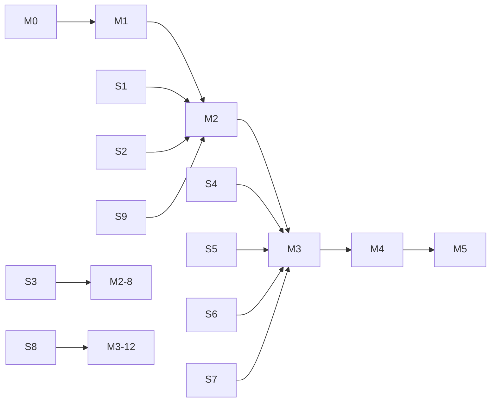

# prefaix — Roadmap & Tasks

This roadmap builds out the system described in [DESIGN.md](DESIGN.md).

- Estimates assume one developer working with coding agents. Each is in **ideal days (d)**.
- Task IDs (`P0-1`, `S3`, `M2-5`, …) are stable, so they can be loaded into bd/beads or GitHub issues as-is.
- `dep:` lists the tasks that must land first.
- **Live tracking is in beads** (`bd ready`, `bd show <id>`), synced to the private DoltHub database `aditzel/prefaix`. Each bead's `external_ref` is `roadmap:<ID>`, which maps it back to this file. Tasks that depend on "M3" as a whole are wired to M3-10 in beads, because bd doesn't let an epic block a task.

## Timeline at a glance

| Milestone | Outcome | Est. | Cumulative |
|---|---|---|---|
| **M0** Foundations | The repo is safe (not publishable), tooling and CI are green, and the design is committed | 1 d | 1 d |
| **M1** Spikes | Every risky assumption in DESIGN §15 is answered and the ADRs are updated | 4–5 d | ~1 wk |
| **M2** Core | Daemon, PiAdapter, client, and renderer work end-to-end from `prefaix run` in a pty | 9–11 d | ~3 wk |
| **M3** Triple-shell MVP → **0.1.0** | `:` UX on zsh, fish, and bash passes the shared e2e gate, and the first npm release ships | 8–10 d | ~5 wk |
| **M4** Parity | Forge-level feature set plus things Forge can't do (detach, steer, `:tui`) | 10–12 d | ~7.5 wk |
| **M5** Hardening → 1.0 | Second adapter proves the port, plus distribution, docs site, and security review | ongoing | — |

---

## M0 — Foundations (1 d)

| ID | Task | Acceptance | dep |
|---|---|---|---|
| **P0-1** | **Make the package unpublishable and name it correctly.** Set `name: @miraiforge/prefaix`, `private: true`, `bin: {prefaix: dist/prefaix.js}`, `type: module`, `engines.node >=22.19`. Update the README npm line. | `npm pkg get private` → `true`. A CI step fails if `private` is not `true` on any ref other than a release tag (`npm publish --dry-run` does **not** enforce `private`, so don't rely on it). The README says `@miraiforge/prefaix`. | — |
| P0-2 | Tooling: bun (lockfile), TypeScript strict, tsup, vitest, ESLint (flat) with Prettier, and `bun run check` (lint, typecheck, test). Add a `no-restricted-imports` rule enforcing DESIGN §4.4 boundaries. | `bun run check` passes on an empty `src/`. A test import from `client/` to `agents/` fails lint. | P0-1 |
| P0-3 | CI skeleton: GitHub Actions `{ubuntu, macos} × {node 22, 24}` running `check`. | Green on `main`. | P0-2 |
| P0-4 | `AGENTS.md`: layering rules, the "no anthropic/openai in live tests" rule, the commit style, and "never publish without Allan". | File exists. Agents follow it. | — |
| P0-5 | Commit `docs/DESIGN.md` and `docs/ROADMAP.md`, plus `docs/adr/0001…0004` for D1 (daemon), D3 (Enter interception), D7 (directives as data), and D9 (bridge extension). | ADRs are one page each, recording the decision, alternatives, and consequences. | — |

---

## M1 — Spikes (4–5 d)

Each spike produces `docs/spikes/Sn-<slug>.md` covering the question, method, raw results, a **decision**, and the DESIGN sections to update. Spike code lives in `scripts/spikes/` and is allowed to be ugly.

| ID | Spike | Method | Decides | Est. |
|---|---|---|---|---|
| **S1** | pi RPC lifecycle | Script a child: prompt → stream → `agent_settled`; abort mid-text and mid-tool; second turn on the same session; stdin-close shutdown; kill -9 mid-turn. Record raw JSONL. **Allowed provider only** (e.g. `--provider google`). | Turn manager's settle/abort contract; first fixtures | 0.5 d |
| **S2** | Pool economics | Extend `scripts/spikes/rpc-startup.mjs`: cold start with and without extensions and `--offline` (baseline so far: ~740–860 ms with extensions, ~215 ms bare). Measure RSS idle and after one turn. Test spare adoption via `get_state.sessionFile`. | `pool.max_children`, spare on/off, `--offline` default | 0.5 d |
| **S3** | cwd-follow | Create a session in dir A, respawn with `--session <file>` from dir B, ask the model to run `pwd` and read a relative file. Inspect the `cwd` section in the transcript. | `workspace.cwd_policy` default (`follow` vs `split`) | 0.5 d |
| **S4** | bash Enter macro | A minimal plugin on bash 4.4, 5.1, and 5.2 (Docker on Linux, brew bash on macOS). Checks: macro plus dynamic re-bind, empty accept-line refresh, `history -s`, multi-line (`\` continuation), vi-insert, running a raw-mode Node child from `bind -x`. | bash plugin design (§4.1.3); floor 4.4 vs 5.0 | 1 d |
| **S5** | zsh widget | A minimal widget: `zle -I` plus empty `accept-line` vs `reset-prompt`; zsh-vi-mode, zsh-autosuggestions, and zsh-syntax-highlighting loaded; bracketed paste of a `:` line; p10k instant prompt. | zsh plugin details (§4.1.1) | 0.5 d |
| **S6** | fish binding | fish 3.6 and 4.x: `history append` vs `merge`, `commandline -f repaint` vs execute-empty, vi mode, the abbr highlight trick, and starship right-prompt wrapping. | fish plugin details (§4.1.2) | 0.5 d |
| **S7** | Raw tty inside widgets | From each shell's hook, run a Node child that calls `setRawMode(true)` then `false`; diff `stty -a` before and after. Check Esc vs arrow timing, Ctrl+C bytes, typeahead capture, SIGWINCH. | Client tty controller (§4.2), whether `stty -g` save/restore is needed | 0.5 d |
| **S8** | Client cold start | Bundle a stub `prefaix run` that connects to a socket and exits. Measure p50 and p95 over 50 runs on macOS and Linux. Compare against a `bun build --compile` binary. | Whether to ship a compiled client (M5) | 0.25 d |
| **S9** | Bridge extension | A 40-line pi extension loaded with `-e`: patch a `prefaix` section in `before_agent_start` from a file; call `pi.setActiveTools()`; confirm the visible user message is unchanged in the session JSONL and that it works in RPC mode. | D9 vs the prepend fallback; personas-without-respawn | 0.5 d |

**M1 exit:** every spike has a written decision, DESIGN.md is updated wherever a **[spike]** marker resolved, and there are at least 5 recorded pi fixtures (text-only, tool calls, abort, retry/error, extension UI).

---

## M2 — Core: daemon + PiAdapter + client (9–11 d)

| ID | Task | Acceptance | dep | Est. |
|---|---|---|---|---|
| M2-1 | `core/`: `agent-port.ts` (types from DESIGN §4.4), error codes, IDs (ULID), paths (XDG plus the `sun_path` fallback), a tiny result/logger. | Types compile. Path tests on macOS and Linux layouts. | P0-2 | 0.5 d |
| M2-2 | `core/config`: TOML load (`smol-toml`), schema defaults, `PREFAIX_*` env overrides, `prefaix config check` with line/column errors. | Unit tests for defaults, overrides, and bad input. | M2-1 | 0.75 d |
| M2-3 | `agents/fake`: FakeAgent with named scenarios (`hello`, `tools`, `long`, `dialog`, `error`, `retry`, `buffer`). Select via `PREFAIX_BACKEND=fake` and `PREFAIX_FAKE_SCENARIO`. | The contract suite (M2-6) passes against fake. | M2-1 | 0.75 d |
| M2-4 | `agents/pi/rpc`: JSONL transport (LF-only framing, StringDecoder), id correlation, timeouts, stderr to log, spawn/ready/close/kill escalation, pre-ready `extension_ui_request` buffering. | Replay tests using the S1 fixtures. A killed child rejects pending requests and ends the turn with `settled(error)`. | M2-1, S1 | 1.5 d |
| M2-5 | `agents/pi/adapter`: event mapping table (DESIGN §4.5.3), tool summaries, models/thinking, commands, lastText, rename, state/stats, `NativeRef` create (`--session-id`) and resume (`--session`). | Contract suite passes on fixture replay. The no-model live smoke passes locally. | M2-4 | 1.5 d |
| M2-6 | `test/contract`: AgentPort contract suite (stream, tools, dialog round-trip, abort mid-tool, error, retry, ordering, lastText). | Runs against fake and pi-fixture in CI. | M2-3 | 0.5 d |
| M2-7 | `agents/pi/bridge`: the bridge extension (context section from the turn file; persona tools). Bundled to `dist/pi-bridge.js`. Capability probe at spawn, with the prepend fallback. | Live test (guarded): the section appears in the transcript and the user message is untouched. Fallback path unit-tested. | S9, M2-5 | 1 d |
| M2-8 | `daemon/`: socket server, hello/version, router, **turn manager** (one per conversation, abort, disconnect policy, event ring with `seq`), **pool** (bind by root and env hash, LRU, idle, spare, crash policy), **store** (atomic JSON), status files, lock plus autospawn target, idle exit, logs. | Integration tests with fake: concurrent conversations, busy rejection, abort, client disconnect → abort, daemon idle exit, stale lock recovery, env-change respawn. | M2-3, M2-4, S2, S3 | 3 d |
| M2-9 | `client/`: connect plus autospawn with backoff; `run` flow; grammar (`shells/grammar.ts`, about 150 table cases); tty controller (raw mode, keys, restore on every exit path, typeahead capture); directives writer (NUL k/v plus nonce). | Unit tests on the grammar and directives round-trip (property tests through real zsh, bash, and fish readers). A pty test shows the tty restored after a crash in the client. | M2-1, S7 | 1.5 d |
| M2-10 | `client/render`: streaming markdown styler, tool lines, spinner, footer, notices, plain/NO_COLOR mode, inline dialogs (select, confirm, input, editor). | Golden tests with randomized chunk boundaries. Visual check in Ghostty and iTerm2. | M2-9 | 1.5 d |
| M2-11 | `cli/`: `prefaix run`, `daemon {start,stop,status,--foreground}`, `conversations {ls,show,rm}`, `debug tap <conv>` (raw adapter JSONL), `--version`. | `prefaix run -- ': hi'` works from a plain pty with fake and with pi. | M2-8, M2-9, M2-10 | 0.5 d |

**M2 exit:** in a raw pty (no shell plugin), `prefaix run --shell zsh … -- ': explain this repo'` streams from real pi with an allowed model. A second invocation continues the conversation. Esc aborts. The tty is always restored. The fake-backend suite is green in CI.

---

## M3 — Triple-shell MVP → 0.1.0 (8–10 d)

| ID | Task | Acceptance | dep | Est. |
|---|---|---|---|---|
| M3-1 | E2E harness: node-pty plus `@xterm/headless`, a screen-wait DSL (`await screen.waitFor(/❯ $/)`), key helpers, per-shell launchers with a clean env and fake backend. | Scenario 1 (normal `ls`) passes for all three shells on macOS and Linux. | M2-11 | 1.5 d |
| M3-2 | **zsh plugin** (`prefaix init zsh`): identity, intercept, invoke, directives, refresh, OSC 133, context ring, keymaps plus the zvm hook. | E2E scenarios 1–9 and 11–12 green on zsh. | S5, M3-1 | 1.25 d |
| M3-3 | **fish plugin** (`prefaix init fish`): same contract, plus the abbr highlight and right-prompt wrap. | Same scenarios green on fish 3.6 and 4.x. | S6, M3-1 | 1.25 d |
| M3-4 | **bash plugin** (`prefaix init bash`): macro plus dynamic rebind, all keymaps, bash-preexec-aware context, `__prefaix_ps1`; **3.2 degraded** `pfx`. | Same scenarios green on bash 4.4 and 5.2. Degraded-mode test on macOS `/bin/bash`. | S4, M3-1 | 1.5 d |
| M3-5 | MVP commands in the client and daemon: `:`, `:new`/`:n`, `:conversation`/`:c` (plus `:c -`), `:model`/`:m`, `:think`, `:info`/`:i`, `:copy`, `:help`/`:?`, `:doctor`, `:/cmd` passthrough, and unknown-command suggestions. | Each command has a fake-backend e2e on at least one shell and unit coverage for arguments. | M2-11 | 1.5 d |
| M3-6 | Pickers: fzf when present (with a preview of the conversation title, root, and last turn), otherwise a built-in raw-mode list. | Both paths are tested (fzf stubbed in CI). | M3-5 | 0.5 d |
| M3-7 | Status and right prompt: the `status` directive, per-shell `prefaix_prompt_info`, zsh RPROMPT opt-in, fish right-prompt wrap, bash PS1 helper, and a starship custom-module snippet in the docs. | Prompt draw spawns 0 processes (asserted in e2e by counting execs with a PATH shim). | M3-2..4 | 0.5 d |
| M3-8 | `prefaix doctor`: pi found, version ≥ tested minimum, RPC handshake and no-model probe; shell version plus plugin loaded; conflicts (Forge plugin, ble.sh); socket and runtime dir permissions; config validity; clipboard tool. Output uses ✓/⚠/✗ with fixes. | A snapshot test for each failure. Never prints env values. | M2-5, M3-2..4 | 0.75 d |
| M3-9 | `prefaix setup`: detect the shell, show the rc diff, append the init line with a marker, back up the rc, idempotent. `prefaix uninstall` reverses it. | E2E on temp HOMEs for all three shells. | M3-2..4 | 0.5 d |
| M3-10 | CI e2e matrix: install zsh, fish 3.6 and 4.x, and bash 4.4 and 5.2 on ubuntu (apt plus Docker for old bash) and macOS (brew). Optional job: install pi and run the no-model smoke. | Required checks on `main`. Flake rate < 1% over 50 reruns. | M3-1..4 | 1 d |
| M3-11 | Docs: README quickstart (install, one rc line, 5 examples), a "Coming from Forge" command map, troubleshooting, config reference (generated from the schema). | A fresh-machine walkthrough by Allan succeeds using only the README. | M3-5..9 | 0.75 d |
| M3-12 | Performance check: budgets from DESIGN §9 are asserted in a perf test (fake backend) and recorded in the release notes. | p50 client start < 60 ms on macOS (M-series) and Linux CI. | S8, M2-11 | 0.25 d |
| **M3-13** | **Release 0.1.0 (needs Allan's explicit go).** Flip `private`, set up an npm trusted publisher (GitHub OIDC), tag-triggered publish with `--provenance`, a GitHub release with notes, verify `npm i -g @miraiforge/prefaix` on a clean machine. | The package is live with provenance, the install walkthrough passes, and the prefaix.dev placeholder links to the README. | all M3 | 0.5 d |

**M3 release gate (all required):**

- The e2e scenario list (DESIGN §12.3, 1–9 and 11–12) is green on zsh, fish, and bash, on both OSes.
- Doctor is clean on Allan's daily-driver machine after removing the Forge plugin line from `~/.zshrc`.
- Allan has used it daily for 3 days on at least two shells, with no tty corruption and no lost typeahead.

---

## M4 — Parity and beyond Forge (10–12 d)

| ID | Task | Acceptance | dep | Est. |
|---|---|---|---|---|
| M4-1 | **Edit class plus `:suggest`/`:s`**: the bridge's `propose_command` tool, a dedicated fast model (`commands.suggest.model`), shell-aware prompt, `set_buffer` → `buffer` directive. | Scenario 10 green on all shells. The suggested command is never executed without Enter. | M3 | 1.5 d |
| M4-2 | **`:commit`**: staged diff (capped at `max_diff_bytes`) → `git commit -m '…'` in the buffer (edit class). A `--run` flag commits directly. | Works with an empty stage (clear error), a huge diff (truncation notice), and the conventional-commit style from config. | M4-1 | 1 d |
| M4-3 | **Detach/attach**: Ctrl+Z → `turn.detach`, status file `⟳`, `:attach` replays from `seq`, `:abort` for detached turns, right-prompt states (running, done, error). | E2E: detach, run `ls`, `:attach` shows the full output; the right prompt reflects completion without a keypress (on the next prompt draw). | M3 | 1.5 d |
| M4-4 | **Steer while typing**: during a turn, Enter sends the captured line as `steer` (shown as `↳ steer: …`); Esc restores queued text via `clear_queue`. | Fake plus pi-fixture tests. Capability-gated with a clear message on backends without steer. | M3 | 1 d |
| M4-5 | **Personas**: `:ask`, `:plan`, user-defined `[personas.*]`, `:plan` → `:go` executes the plan with full tools in the same conversation. | The persona tool set is verified in the transcript. Unknown persona: a helpful error. | M2-7 | 1 d |
| M4-6 | **`:skill` / `:/cmd` / completions**: `commands.list` cache; Tab completion for `:` names, skills, models, conversations (zsh widget, fish `complete`, bash `complete -D`-free approach); fish abbr highlight already in place. | Tab after `:sk` completes `:skill`; after `:skill ` it lists skills. | M3 | 1.5 d |
| M4-7 | **`:tui` handoff**: release the pooled child, run `pi --session <file>` in the root with the shell env, re-adopt afterwards. | Round trip: prefaix → TUI (see history) → exit → `: continue` in prefaix sees the TUI's turns. | M3 | 0.5 d |
| M4-8 | `:retry`, `:compact`, `:rename`, `:export` (pi `export_html`). | One e2e each on the fake backend, plus a live smoke for compact. | M3 | 1 d |
| M4-9 | **Context capture v2**: redaction hardening, optional scrollback capture (tmux `capture-pane`, kitty, WezTerm) behind `context.capture_output`, and `@file` mentions (fd plus fzf completion; passed as paths the model reads). | Redaction corpus ≥ 200 cases. Capture is off by default and documented. | M3 | 1.5 d |
| M4-10 | Terminal niceties: OSC 52 clipboard fallback, OSC 8 links for file paths in tool lines, optional OSC 0 title from `setTitle`, and a busy-conversation follow-up queue (`followUp`). | Manual check matrix in Ghostty, iTerm2, WezTerm, kitty, tmux. | M3 | 0.75 d |

---

## M5 — Hardening → 1.0 (ongoing)

| ID | Task | Notes |
|---|---|---|
| M5-1 | **Second adapter** to prove `AgentPort`: pick a backend with a JSONL/RPC mode, implement it behind capabilities, and publish the capability matrix. | Live tests follow the same guard, so no Anthropic/OpenAI billing without explicit approval. |
| M5-2 | `:backend` switching per shell plus `agent.backend` config. | Needs M5-1. |
| M5-3 | Compiled client if S8/M3-12 budgets are at risk (Node SEA or `bun build --compile`), shipped via optional platform packages. | Keep the pure-Node fallback. |
| M5-4 | Security review: directives, socket/dir perms, env handling, redaction, bridge extension surface. Fuzz the grammar and directives. | Write `SECURITY.md`. |
| M5-5 | Distribution: Homebrew tap `miraiforge/tap/prefaix`, fisher-compatible layout, prefaix.dev docs site (Cloudflare Pages). | |
| M5-6 | WSL validation, and Linux terminals (GNOME Terminal, Konsole, foot). | |
| M5-7 | ble.sh support investigation (ble widgets). | Only if there's demand. |

---

## Risk register

| Risk | L | I | Mitigation / trigger |
|---|---|---|---|
| bash macro/rebind is flaky across versions or keymaps | M | H | S4 first. Fallback: Enter → `bind -x` sets the line to the `__prefaix_exec` token and a macro accepts it (the dispatch runs as a real command); history is fixed up via `history -d`. |
| Raw mode inside widgets leaves the tty broken | M | H | S7, plus `stty -g` save/restore, a restore in every exit path, and the e2e scenario 5 `stty -a` diff. |
| pi RPC changes on upgrade | M | M | Type-only pinned dev dependency, the no-model smoke in CI, the doctor version check, and the `debug tap` tool for fast diagnosis. |
| Env inheritance surprises (a stale PATH in the agent) | M | M | Env fingerprint respawn (D8). `:info` shows the child's env hash age. |
| Warm children eat RAM | M | M | S2 numbers set `max_children`/idle; spare is optional. |
| Model cost rule violated by tests | L | H | `live-guard.ts` is mandatory for live runs; explicit provider/model flags; fixture header records provider. |
| Forge users' muscle memory conflicts (both plugins loaded) | H | L | Doctor detection, a README migration table, the same aliases. |
| Scope creep into rebuilding pi's TUI | M | M | Non-goal; `:tui` handoff instead. |

---

## Suggested order for the first week

1. **P0-1** now (5 minutes). The package must not be publishable by accident.
2. P0-2 → P0-3 → P0-5 (half a day).
3. S1, S2, and S9 in parallel. They share one throwaway script dir and one allowed provider.
4. S4 and S7 next: bash plus raw tty is the biggest technical risk to the "three shells at launch" promise.
5. S5, S6, S3, S8.
6. Start M2-1 through M2-4 once S1 lands. The core doesn't wait on the shell spikes.
